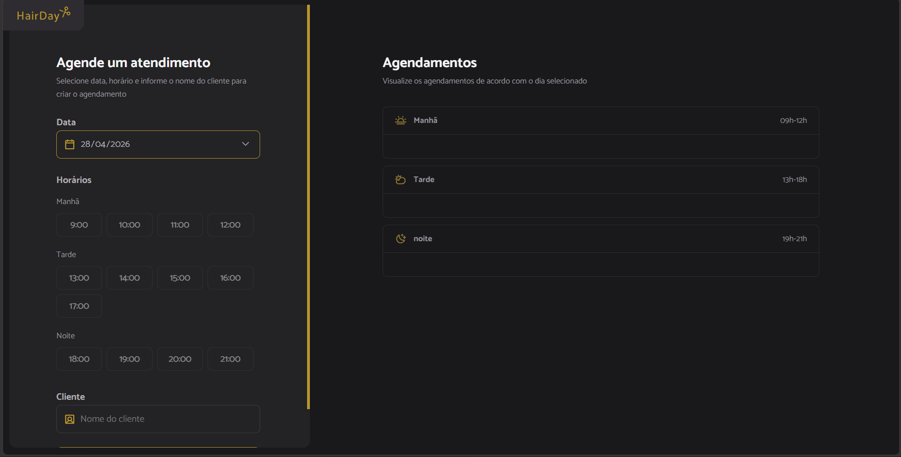

# HairDay - Sistema de Agendamento

## Descrição

O HairDay é um sistema web simples para gerenciamento de agendamentos de atendimentos. Ele permite selecionar uma data, escolher um horário disponível, cadastrar o nome do cliente e visualizar ou cancelar agendamentos organizados por período do dia.

---

## Prévia do Projeto


  
---

## Funcionalidades

* Seleção de data para agendamento
* Exibição de horários disponíveis
* Separação de horários por período (manhã, tarde e noite)
* Criação de novos agendamentos
* Cancelamento de agendamentos
* Atualização automática da lista após ações
* Bloqueio de horários já ocupados
* Bloqueio de horários no passado

---

## Regras de Negócio

* Um horário só pode ser selecionado se:

  * Não estiver ocupado
  * Não estiver no passado

* Períodos do dia:

  * Manhã: 09h às 12h
  * Tarde: 13h às 18h
  * Noite: 19h às 21h

---

## Tecnologias Utilizadas

* HTML5
* CSS3
* JavaScript (ESModules)
* Day.js (manipulação de datas)
* JSON Server (simulação de API)
* Webpack

---

## Estrutura do Projeto

```
HAIR-DAY/
├── dist/
├── node_modules/
├── src/
│ ├── assets/
│ ├── libs/
│ ├── modules/
│ │ ├── form/
│ │ │ ├── date-change.js
│ │ │ ├── hours-click.js
│ │ │ ├── hours-load.js
│ │ │ └── submit.js
│ │ ├── schedules/
│ │ │ ├── cancel.js
│ │ │ ├── load.js
│ │ │ ├── show.js
│ │ │ └── page-load.js
│ ├── services/
│ │ ├── api.config.js
│ │ ├── schedule-cancel.js
│ │ ├── schedule-fetch-by-day.js
│ │ └── schedule-new.js
│ ├── styles/
│ ├── utils/
│ │ └── opening-hours.js
│ └── main.js
├── index.html
├── server.json
├── webpack.config.js
├── package.json
├── README.md
└── .gitignore
```

---
## Como Rodar o Projeto

### 1. Clonar o repositório

```
git clone https://github.com/Anaelica/hair-day
```

---

### 2. Instalar dependências

```
npm install
```

---

### 3. Rodar o servidor da API (JSON Server)

Você pode usar o script já configurado no projeto:

```
npm run server
```

Ou manualmente:

```
npx json-server server.json --watch --port 3001
```

---

### 4. Rodar o projeto

```
npm run dev
```

---

## Endpoints da API

Base URL:

```
http://localhost:3001
```

Rotas:

* GET `/schedules` → lista agendamentos
* POST `/schedules` → cria agendamento
* DELETE `/schedules/:id` → remove agendamento

---


## Fluxo da Aplicação

1. O usuário seleciona uma data
2. Os horários disponíveis são carregados
3. O usuário escolhe um horário
4. Informa o nome do cliente
5. O agendamento é salvo na API
6. A lista de agendamentos é atualizada
7. O usuário pode cancelar um agendamento

---

## Autor

Anaelica Barbosa 

Projeto desenvolvido para fins de estudo de JavaScript e manipulação de DOM com integração a API.
